<h3><code>mario@github ~ $ whoami</code></h3>

<table>
<tr>
<td valign="top"></td>
<td valign="top"></td>
</tr>
</table>

 

<h3><code>mario@github ~ $ ./contributions.sh</code></h3>

# Hi, I'm Mario 👋

IT Support technician and cybersecurity student. I troubleshoot hardware, software, accounts, and networks, and I document what I fix so the next person doesn't have to start from scratch.

## About Me
- 🛠️ Over a year of IT support experience in a healthcare environment
- 🎓 Associate's degree in Cybersecurity, now working on my Bachelor's
- 📜 CompTIA A+ certified
- 🎯 Goal: grow from Help Desk into a SOC Analyst role

## What I'm Building
| Project | Status |
|---|---|
| Active Directory Help Desk Lab | 🔨 In progress |
| PowerShell Help Desk Toolkit | 📋 Planned |
| IT Ticketing System + Knowledge Base | 📋 Planned |

## Skills
**Support:** Windows 10/11, Active Directory, Group Policy, Microsoft 365, hardware troubleshooting, user onboarding and offboarding

**Tools:** PowerShell, VirtualBox, Windows Server, ticketing systems

**Security:** Cybersecurity fundamentals, digital forensics, ethical hacking coursework

## Connect With Me

<h3><code>mario@github ~ $ ./links.sh</code></h3>

<b>IT Support · Help Desk · Cybersecurity Student</b>

